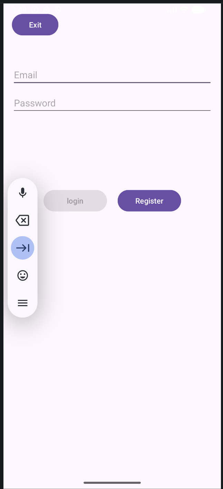

# Android Ordering App (Practice)

A small Android project that demonstrates an **ordering-style** flow—**menu**, **cart**, and **order** screens—built with **Java** and **MVVM**. Data is **mocked** so the codebase can later plug in a real backend.

---

## Why I Built This

I wanted a focused portfolio piece for **intern applications** that shows I can:

- Apply **MVVM** (UI / ViewModel / data layer) in a real project structure  
- Use common **Jetpack** pieces (`ViewModel`, `LiveData`, **Navigation**)  
- Implement **RecyclerView** with custom **Adapters**  
- Combine **Activity + Fragment** navigation and basic **session / login** flow  

---

## Features

| Area | Description |
|------|-------------|
| Login | Standalone `LoginActivity` with mock credential checks; returns to the main shell after success |
| Shell | `MainActivity` with `NavHostFragment` and bottom navigation for Menu / Cart / Order |
| Menu | Categories, dish list, quantity controls (wired toward cart-style state) |
| Cart | Line items, clear / checkout entry points (extend as needed) |
| Order | Order-related screen / flow (extend as needed) |

---

## Tech Stack

- **Language:** Java  
- **UI:** ViewBinding, Material, `ConstraintLayout` / `LinearLayout`  
- **Architecture:** MVVM (`ViewModel` + `LiveData`)  
- **Navigation:** Jetpack Navigation + `BottomNavigationView`  
- **Lists:** `RecyclerView` + custom `Adapter`s  
- **Build:** Gradle (Version Catalog / `libs.versions.toml`)  
- **Image Loading:** Glide
---

## Project Layout (High Level)

```
MyApplication/
├── README.md
├── .gitignore
├── build.gradle
├── settings.gradle
├── gradle.properties
├── gradlew
├── gradlew.bat
├── gradle/
│   ├── libs.versions.toml         
│   ├── gradle-daemon-jvm.properties
│   └── wrapper/
│       └── gradle-wrapper.properties
│
└── app/
    ├── build.gradle         
    └── src/main/
        ├── AndroidManifest.xml
        ├── java/com/example/myapplication/
        │   ├── MainActivity.java
        │   ├── data/
        │   │   ├── Result.java
        │   │   ├── login/            # LoginDataSource, LoginRepository
        │   │   ├── menu/             # MenuDataSource, MenuRepository
        │   │   ├── order/            # OrderDataSource, OrderRepository
        │   │   └── model/            # LoggedInUser, Category, MenuItem, CartItem, Order, OrderItem…
        │   └── ui/
        │       ├── login/            # LoginActivity, LoginViewModel, Factory, FormState…
        │       ├── menu/             # MenuFragment, MenuViewModel, BottomSheet, adapter/
        │       ├── cart/             # CartFragment, CartViewModel, adapter/
        │       └── order/            # OrderFragment, OrderViewModel, adapter/
        │
        └── res/
            ├── layout/               # activity_*, fragment_*, item_*, dialog_*, bottom_sheet_*
            ├── navigation/
            │   └── nav_graph.xml
            ├── menu/
            │   └── bottom_nav_menu.xml
            ├── values/               # strings, themes, colors, dimens…
            ├── values-night/
            ├── xml/                  # backup / data extraction 等
            ├── drawable/
            └── mipmap-*/
```

---

## Requirements

- **Android Studio** (recent stable)  
- **JDK 17** aligned with your Android Gradle Plugin (if you see `jlink`-related build errors, point Gradle / the IDE to a **full JDK**, not a stripped JRE)  
- Android SDK levels as defined in `app/build.gradle`  

---

## How to Run

1. Open the project root (folder containing `settings.gradle`) in Android Studio.  
2. Wait for Gradle sync to finish.  
3. Run on an emulator or device.  

**Mock credentials:** see `app/src/main/java/.../data/LoginDataSource.java` (update this README if you change test accounts).
| Username | Password |
|----------|----------|
| admin    | 123456   |
| test     | 111111   |
---

## What I Practiced Here

- **Observable UI state:** Fragments observe `LiveData`; business updates happen in `ViewModel` / repositories  
- **Scoping:** When to use `ViewModelProvider(this, …)` vs `requireActivity()` for shared cart-style state  
- **List patterns:** `ViewHolder` caching; room to evolve from `notifyDataSetChanged()` to `DiffUtil`  
- **Navigation:** Keeping login separate from the main graph while avoiding confusing back stacks  
---

## Possible Next Steps

- [ ] **Spring Boot backend** – REST endpoints for auth, menu and order APIs
- [ ] **Retrofit** – replace mock `DataSource` classes with real HTTP calls
- [ ] **JWT auth** – replace UUID token with proper JWT; store securely on device
- [ ] **Room** – offline cart persistence so data survives process death
- [ ] **Real menu data** – serve dish list and images from the backend
- [ ] **Order status push** – poll or use WebSocket to update PREPARING → COMPLETED
- [ ] **Unit tests** – cover `ViewModel` and repository layer
- [ ] **Hilt** – replace manual `getInstance()` singletons with dependency injection

---

## Screenshots





## Contact

- Name: _your name_  
- Email: _your email_  
- Target role: Android Intern  
